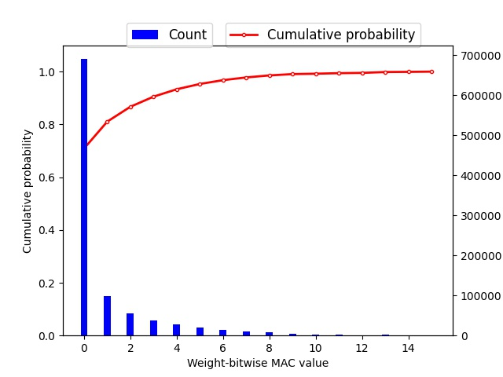

# quantization for test
This repository refers to [Chahal's blog](https://karanbirchahal.medium.com/aggressive-quantization-how-to-run-mnist-on-a-4-bit-neural-net-using-pytorch-5703f3faa599)

## 网络结构
```python
# in_channel for mnist is 1, and the input shape is (batch_size, 1, 28, 28), output shape is (batch_size, 20, 24, 24)
convolution_layer_1(in_channel=in_channel, out_channel=20, kernel_size=5, stride=1)

# output shape is (batch_size, 20, 12, 12)
max_pool(2, 2)

# output shape is (batch_size, 20, 8, 8)
convolution_layer_2(in_channel=20, out_channel=50, kernel_size=5, stride=1)

# output shape is (batch_size, 20, 4, 4)
max_pool(2, 2)

full_connection_layer_1(4*4*50, 500)

full_connection_layer_2(500, 10)
```

## 代码运行

使用aware quantization在mnist上进行4bit量化实验，运行代码：

```bash
python main.py
```

对量化权重进行统计，运行代码：
```bash
python weight_plot.py
```
统计结果见图 

